# Lab 3 - Sales Forecasting (Retail)

> This lab takes significantly longer than others, since it uses the **Standard Build** option (around 3-4 hours).

## Agenda

1. [Overview](#overview)
2. [A forenote](#a-forenote)
3. [Import the dataset in Canvas](#import-the-dataset-in-canvas)
4. [Building and Training a ML model](#building-and-training-a-ml-model)
5. [Using the model to generate predictions](#using-the-model-to-generate-predictions)

## Overview

In this lab, you will assume the role of a business analyst working for an e-commerce company, in the sales department. You will use historical time-series sales data for retail stores to build a model which can be used to forecast sales for a particular retail store. The data schema is as follows:

| Column Name   | Data type  |
| ------------- | ---------- |
| store         | INT        |
| saledate      | TIMESTAMP  |
| sales         | DECIMAL    |
| promo         | INT (0 /1) |
| schoolholiday | INT (0/1)  |

If you're using going for this option, download the [CSV file](./Data/store_daily_sales_reduced.csv).

Go to the AWS Management Console, search **S3** in the searchbox on top of your console, then go to **S3** service console.

In the S3 console, click on the **sagemaker-studio-\*** bucket.

> The **sagemaker-studio-\*** bucket was created automatically when you created the SageMaker Studio domain in the **Prerequisites** section. If you follow the **Event Engine** track, the bucket was pre-provisioned by you instructor.

Click **Upload**.

On the Upload page, drag and drop the `store_daily_sales_reduced.csv` file you've just downloaded, then click **Upload** at the bottom of the page. Once the upload is complete, you can now click the top-right **Close** button. You should now see the file uploaded in your bucket.

## Import the dataset in Canvas

Go to the SageMaker Canvas tab created in the **Prerequisites** section. On the left menu, you can click the second icon to head to the Datasets section, then click the **Import** button.

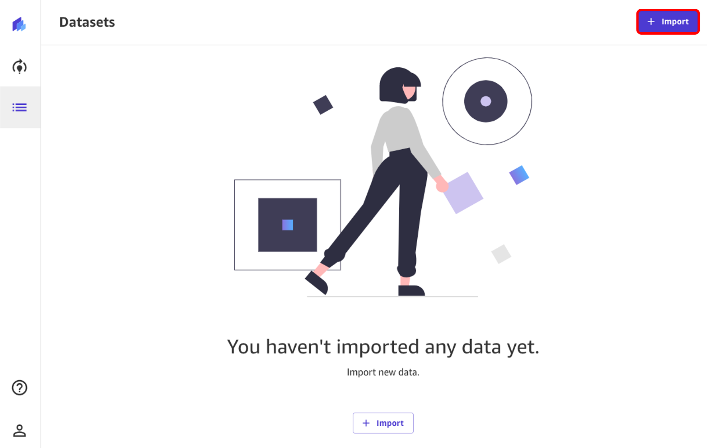

Now, select the bucket where we've previously uploaded our dataset, the **sagemaker-studio-\*** bucket.

You can now select the `store_daily_sales_reduced.csv` file uploaded previously by selecting the checkbox at its left. Two new buttons will pop-up at the bottom of your page: **Preview all** and **Import Data**. Let's choose the first one.

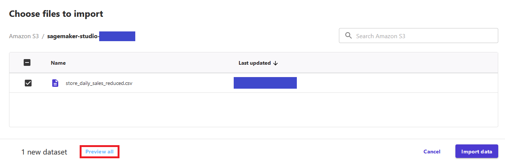

You now face a 100-rows preview of the dataset you're looking to import. Once you're done checking that it's indeed the right one, you can click on **Import Data**.

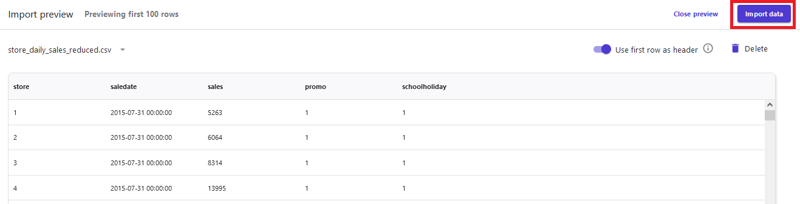

## Building and Training a ML model

Now that the dataset is imported, you can create a new model by going to the Models screen, and clicking on the **+ New Model** button.

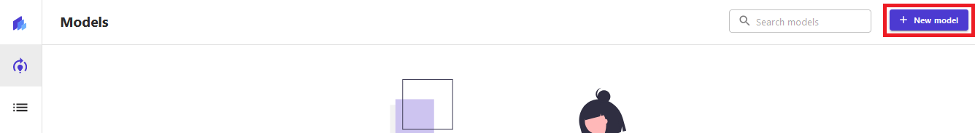

On the **Create new model** popup screen, write `store_sales_forecast_model` for the model name and click on the **Create** button.

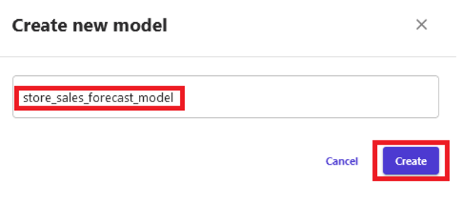

On the **Select dataset** screen, select `store_sales_data` for the dataset and click on the **Select dataset** button.

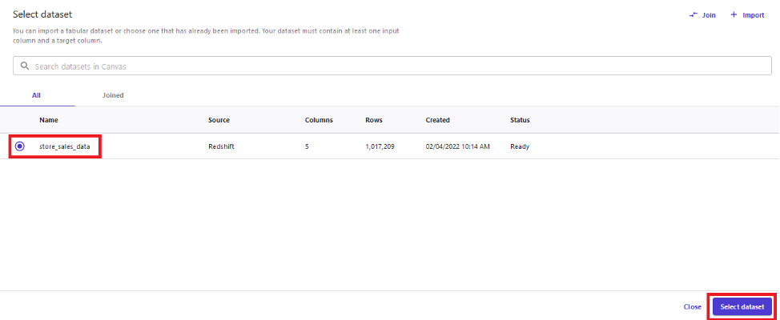

On the next screen, you can configure the model for training. You can also select columns to see statistics of each column. Select `sales` for the **Target column** field. Canvas will automatically select **Time series forecasting** as the model type. Click on the **Configure** link.

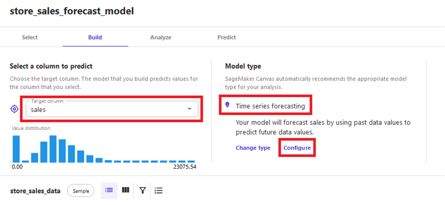

The Time Series Forecasting configuration popup screen, you are asked to provide a few information:

- The **items field**: how you identify you items in the datasets in a unique way; for this use case, select `store` since we are planning to forecast sales per store
- The **group column**: if you have logical groupings of the items selected above, you can choose that feature here; we don't have one for this use case, but examples would be `state`, `region`, `country`, or other groupings of stores.
- The **time stamp field**: select `saledate` here, which is the feature that contains the time stamp information; Canvas requires data timestamp in the format `YYYY-MM-DD HH:mm:ss` (e.g.: `2022-01-01 01:00:00`)
- Write `120` in the **number of Days** field.

Finally, click on the **Save** button.

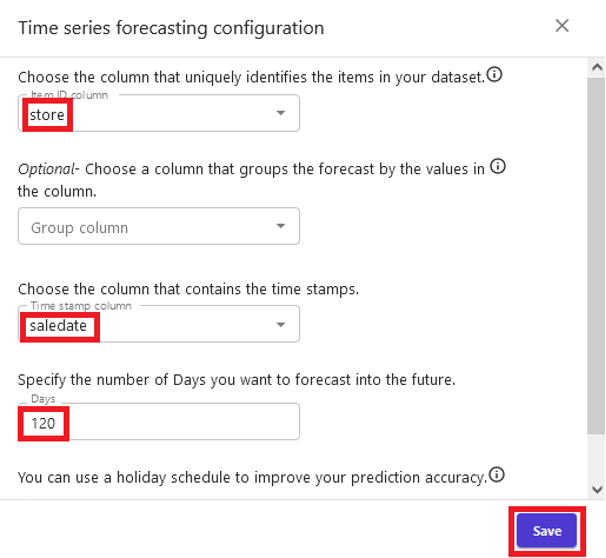

Now that the configuration is done, we're ready to train the model. At the moment of writing, SageMaker Canvas does not support *Quick Build* for Time-Series Forecasting, therefore we will select the **Standard Build** option, and start training the model. Model will take around 3-4 hours to train.

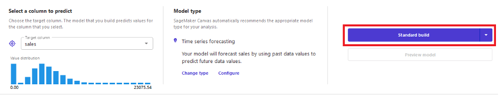

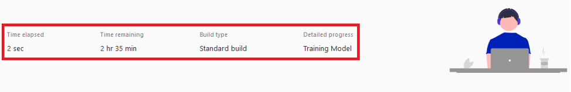

## Using the model to generate predictions

When the model training finishes, you will be routed to the **Analyze** tab. There, you can see the average prediction accuracy, and the column impact on prediction outcome. Click on the **Predict** button, to be brought to the **Predict** tab.

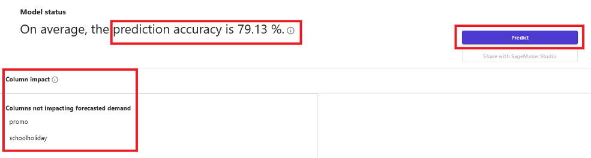

In order to create forecast predictions, you have to provide first the date range for which the forecast prediction can be made. Then, you can generate forecast predictions for all the items in the dataset or a specific item.

In our workshop, we choose the **Single item** option, and select any of the items from the item dropdown list. We choose number 5 here, and Canvas generates a prediction for our item, showing the average prediction, an upper bound and a lower bound. Canvas provides both results, since it is generally suggested to have bounds rather than a single prediction point so that you can pick whichever fits best your use case: you might want to reduce waste of resources by choosing to use the lower bound, or you might want to choose to follow the upper bound to make sure that you meet customer demand.

For the generated forecast prediction, you can click on the **Download** dropdown menu button to download the forecast prediction chart as image or forecast prediction values as CSV file.

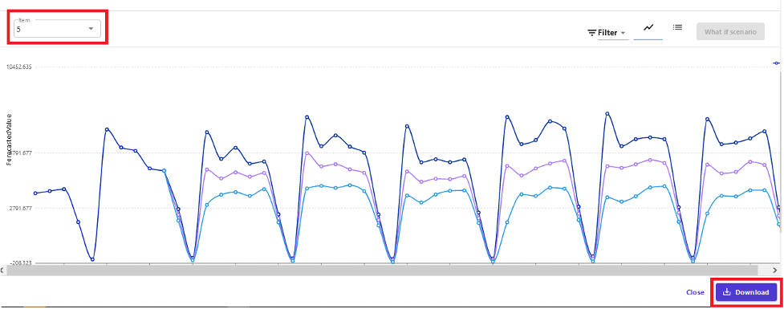

**Congratulations!** You've now completed lab 3. You can now go ahead and choose a new lab to run.